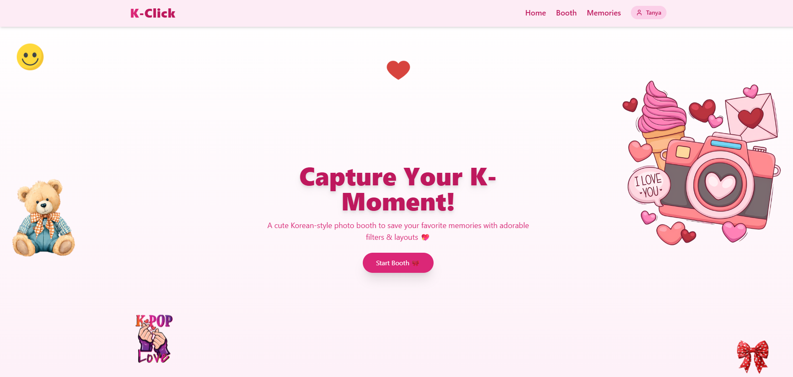
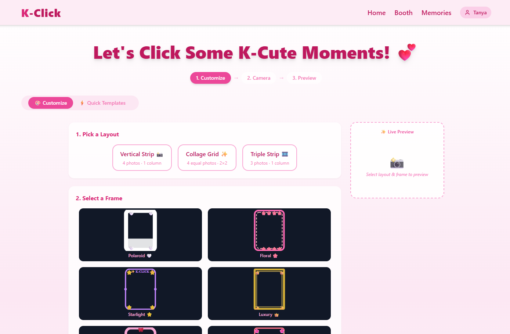
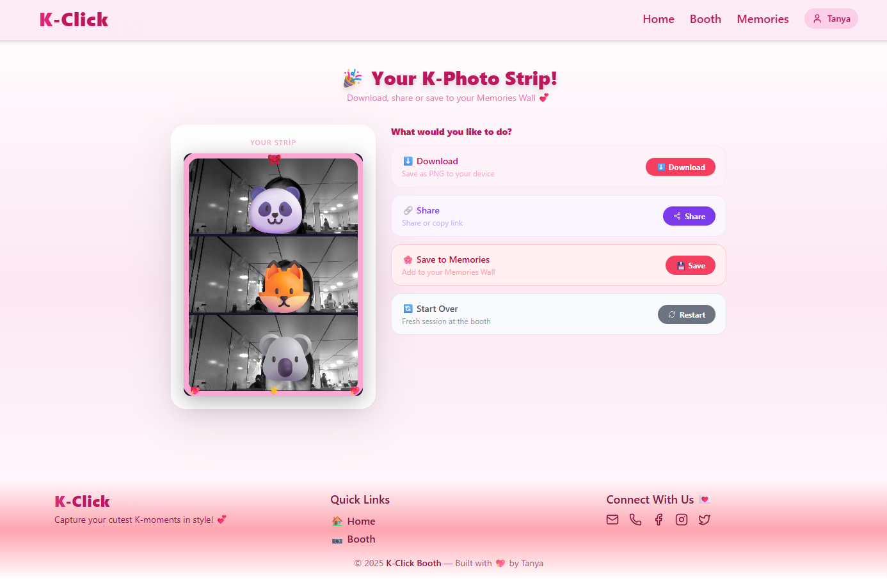
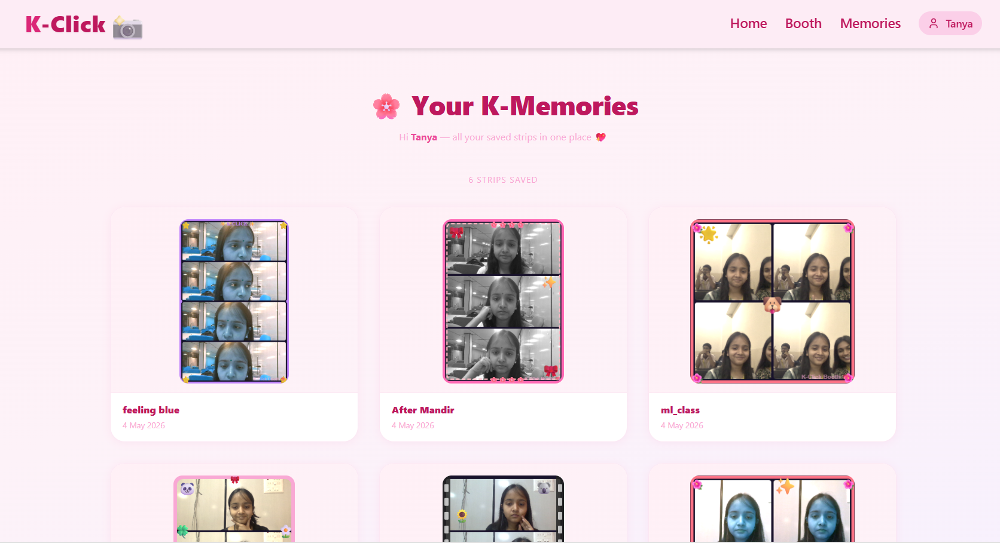

# 📸 K-Click Booth

A modern, stylish, and interactive **Photo Booth Web App** that lets users capture, customize, and preserve aesthetic photo strips with a smooth and delightful user experience.

<p align="center">
  <a href="https://github.com/TanyaVaish-17/photo-booth">
    
  </a>
  <a href="https://k-click-booth.vercel.app/">
    
  </a>
</p>

---

## ✨ Features

* 📷 Interactive Photo Capture
* 🎨 Real-time Customization (filters, frames, stickers)
* 🖼️ Live Preview System
* 🧩 Quick Templates
* 📁 Download & Retake Options
* 💖 Memories Page (Save & Revisit Photos)
* 📱 Fully Responsive UI

---

## 🛠️ Tech Stack

| Category   | Tech         |
| ---------- | ------------ |
| Frontend   | React, Vite  |
| Styling    | Tailwind CSS |
| Routing    | React Router |
| Deployment | Vercel       |

---

## 📁 Folder Structure

```bash
photo-booth/
├── frontend/
│   ├── public/
│   │   └── screenshots/
│   ├── src/
│   │   ├── assets/
│   │   ├── components/
│   │   ├── pages/
│   │   │   ├── Home.jsx
│   │   │   ├── Booth.jsx
│   │   │   ├── Result.jsx
│   │   │   └── Memories.jsx
│   │   ├── App.jsx
│   │   └── main.jsx
│   ├── index.html
│   ├── package.json
│   └── vite.config.js
├── .gitignore
└── README.md
```

---

## 🖼️ Screenshots

### 🏠 Home Page



### 📸 Booth Page



### 🖼️ Result Page



### 💖 Memories Page



---

## 🚀 Getting Started

### Clone the repository

```bash
git clone https://github.com/TanyaVaish-17/photo-booth.git
```

### Navigate to project

```bash
cd photo-booth/frontend
```

### Install dependencies

```bash
npm install
```

### Run development server

```bash
npm run dev
```

---

## 🌐 Deployment

Deployed using **Vercel**

* Push code to GitHub
* Import project in Vercel
* Select `frontend` as root directory
* Deploy 🚀

---

## 💡 Future Enhancements

* 🎥 GIF / Video Booth Mode
* 📲 Social Sharing
* 💖 More Templates
* ☁️ Cloud Storage for Memories

---

## 👩‍💻 Author

**Tanya Vaish**
https://github.com/TanyaVaish-17

---

## ⭐ Support

If you like this project, give it a ⭐ on GitHub!

---

<p align="center">Made with 💖 by Tanya</p>
